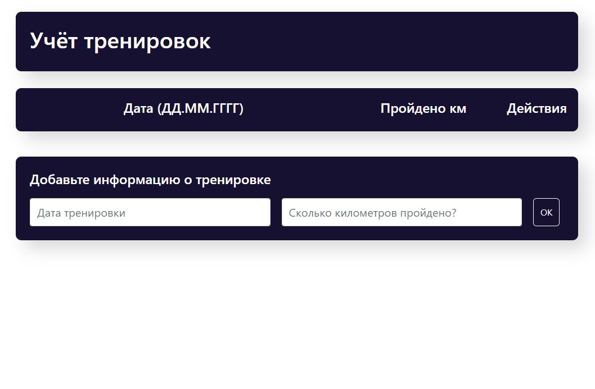

# Учёт тренировок

Учебный проект курса [React для JS-разработчиков](https://netology.ru/programs/react)

## **Задача**

Реализовано небольшое приложение, которое хранит данные о тренировках и прогулках, которые совершаются в течение недели

## **Добавление данных**

Присутствует форма ввода, в которую вводится дата и количество пройденных километров. Новые значения добавляются в таблицу при отправке формы.

Особенности добавления:

* Новые значения добавляются не в конец, а согласно сортировке по дате, то есть если добавляется 21.05.2023, то значение встанет на первую позицию, а если 18.05.2023 — то на последнюю.
* Если добавляется значение, указывая уже существующую дату, то значения суммируются с теми, что хранятся в таблице.

## **Удаление данных**

С помощью иконки удаления есть возможность удалить строку. Удаляется вся строка целиком и данные, связанные с ней.

## **Редактирование данных**

Реализована кнопка редактирования ✎, при нажатии на которую происходит перенос данных в форму ввода с последующим сохранением при нажатии кнопки Ok.

## **Стек технологий**

## [**Демо**](https://steps-lake.vercel.app/)

